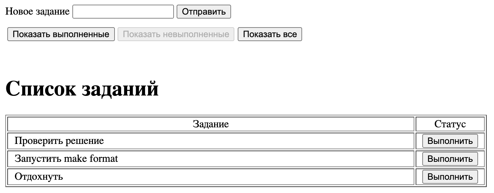
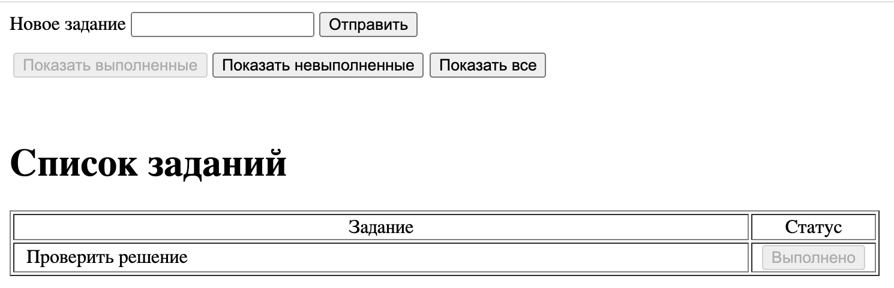
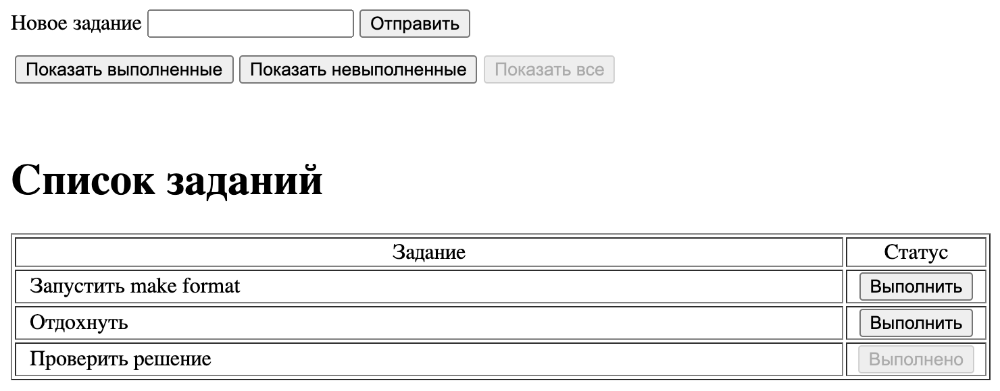

# ToDo list

### Общее описание:
В этом проекте представлен веб-сервис для ведения ToDo списка в котором реализована основная бизнес-логика

Для запуска достаточно ввести команду "make up"

*********

### Screeenshots

В самом начале страницы есть поле для ввода новых задания, нажимая "Отправить", пользователь создаёт новое задание, которое попадает на главный экран

На главном экране веб-сервиса можно видеть список дел, которые необходимо выполнить:

*********

При нажатии на кнопку "Выполнить", задание перемещается в раздел выполненных:

*********

В последнем разделе можно увидеть все задания, как требующие выполнения, так и уже выполненные:

